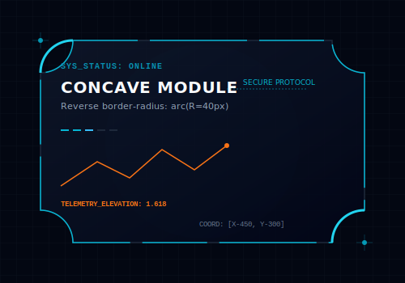
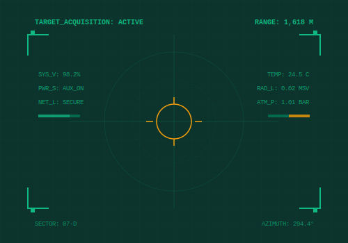
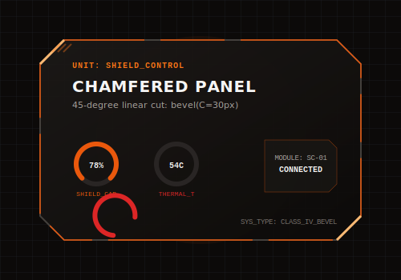

# Sci-Fi UI Design: Inverted Corners & Beveled Cuts

In futuristic UI design, gaming interfaces, and digital Heads-Up Displays (HUDs), traditional rounded cards can feel too generic or soft. To establish a high-tech, military-grade, or cyberpunk aesthetic, designers use **inverted (concave) corners** and **chamfered (beveled) cuts**.

This guide covers the design principles, visual examples, and implementation techniques (CSS & SVG) for this aesthetic.

---

## 1. Inverted / Concave Corners (Reverse Border Radius)

Instead of rounding outward like a standard container, the corners curve inward, creating a scooped-out geometric notch.



### Implementation Techniques

#### A. SVG Path (The Cleanest & Most Accurate Method)
Since HTML elements do not have an `inverted-border-radius` property, utilizing an SVG path is the most reliable way to render these shapes responsively.

```xml
<!-- Example Card SVG with Inverted Corners (Radius: 30px) -->
<svg viewBox="0 0 400 250" width="100%">
  <!-- Inner scooped path formula:
       H = Horizontal Line
       V = Vertical Line
       A = Arc Curve (A rx ry x-axis-rotation large-arc-flag sweep-flag x y)
       - Sweep flag 0 forces the curve inwards toward the card's center.
  -->
  <path d="M 50,20 
           H 350 
           A 30,30 0 0 0 380,50 
           V 200 
           A 30,30 0 0 0 350,230 
           H 50 
           A 30,30 0 0 0 20,200 
           V 50 
           A 30,30 0 0 0 50,20 Z" 
        fill="#0f172a" 
        stroke="#06b6d4" 
        stroke-width="2"/>
</svg>
```

#### B. CSS `mask` & `radial-gradient` (For Responsive HTML Containers)
You can mask regular HTML `div` containers to create dynamic inverted corners using CSS radial gradients:

```css
.concave-card {
  background: #0f172a;
  border: 1px solid #1e293b;
  width: 350px;
  height: 200px;
  
  /* Masking out the four corners with 20px radial circles */
  mask: 
    radial-gradient(20px at 0 0, #0000 98%, #000 100%) 0 0 / 51% 51% no-repeat,
    radial-gradient(20px at 100% 0, #0000 98%, #000 100%) 100% 0 / 51% 51% no-repeat,
    radial-gradient(20px at 0 100%, #0000 98%, #000 100%) 0 100% / 51% 51% no-repeat,
    radial-gradient(20px at 100% 100%, #0000 98%, #000 100%) 100% 100% / 51% 51% no-repeat;
  -webkit-mask:
    radial-gradient(20px at 20px 20px, #0000 98%, #000 100%) -20px -20px / 51% 51% no-repeat,
    radial-gradient(20px at 0px 20px, #0000 98%, #000 100%) 100% -20px / 51% 51% no-repeat,
    radial-gradient(20px at 20px 0px, #0000 98%, #000 100%) -20px 100% / 51% 51% no-repeat,
    radial-gradient(20px at 0px 0px, #0000 98%, #000 100%) 100% 100% / 51% 51% no-repeat;
}
```

---

## 2. Sci-Fi / HUD UI (Heads-Up Display)

Combining inverted corners with thin borders, glowing indicators, telemetry data, and custom grid brackets creates the classic military or cyberpunk sci-fi UI feel.



### Design Hallmarks:
1.  **Glow Filters (Drop-Shadows)**: Utilizing high-intensity neon colors (cyan `#06b6d4`, toxic green `#10b981`, warning orange `#f97316`) paired with strong CSS/SVG gaussian blur filters to simulate luminescent digital displays.
2.  **Dashed Borders**: Using `stroke-dasharray` in SVGs or `border-style: dashed` in CSS to break up solid lines, mimicking data scanlines.
3.  **Crosshairs & Brackets**: Overlaying small `$+$` symbols, boundary brackets, and coordinate labels `[X:04, Y:78]` at structural intersections to emphasize positioning tracking.
4.  **Monospace Fonts**: Using technical fonts (e.g., *Courier New*, *Share Tech Mono*, *Fira Code*) for UI indicators.

---

## 3. Chamfered / Beveled Cuts

While concave corners are curved smoothly inward, a **chamfer** is a straight, diagonal $45^\circ$ cut across the corner. This represents armored plating, mechanical casings, and rugged military instrumentation.



### CSS Implementation with `clip-path`
You can easily build chamfered corners on responsive HTML boxes without needing SVGs using the CSS `clip-path` polygon function:

```css
.chamfer-card {
  background: #1c1917;
  width: 350px;
  height: 200px;
  
  /* Slice 20px off each of the 4 corners:
     Top-left: (20px, 0) & (0, 20px)
     Top-right: (calc(100% - 20px), 0) & (100%, 20px)
     Bottom-right: (100%, calc(100% - 20px)) & (calc(100% - 20px), 100%)
     Bottom-left: (20px, 100%) & (0, calc(100% - 20px))
  */
  clip-path: polygon(
    20px 0%, 
    calc(100% - 20px) 0%, 
    100% 20px, 
    100% calc(100% - 20px), 
    calc(100% - 20px) 100%, 
    20px 100%, 
    0% calc(100% - 20px), 
    0% 20px
  );
}
```

#### Tailwind CSS Utility Shortcut:
If you are using Tailwind CSS, you can apply this inline using the arbitrary value `clip-path` tag:

```html
<div class="w-80 h-48 bg-stone-900 [clip-path:polygon(20px_0%,calc(100%-20px)_0%,100%_20px,100%_calc(100%-20px),calc(100%-20px)_100%,20px_100%,0%_calc(100%-20px),0%_20px)] border border-orange-500">
  <!-- Content Here -->
</div>
```

---

## 4. Visual Comparison

| Aesthetic | Geometric Profile | Emotional Response | Recommended Use Case |
| :--- | :--- | :--- | :--- |
| **Inverted Corners** | Concave Arc ($\sim 90^\circ$ hollow) | Sleek, liquid, advanced tech, organic scifi | AI cores, high-tech scanners, spaceship consoles |
| **HUD Brackets** | Modular framing & brackets | Target tracking, scanning, data-rich | Tactical telemetry screens, map indicators |
| **Chamfered Cuts** | Straight $45^\circ$ diagonal bevel | Hardened, armored, industrial, tactical | Inventory panels, weaponry displays, hardware dashboards |
