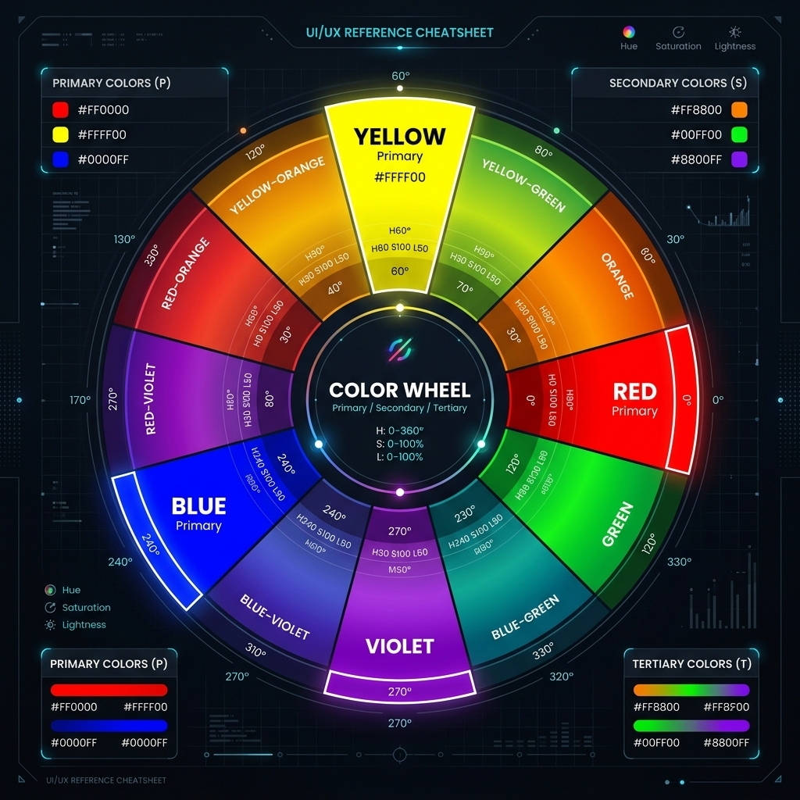
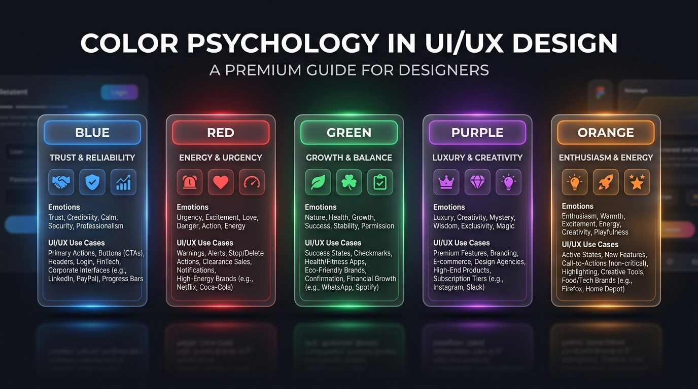
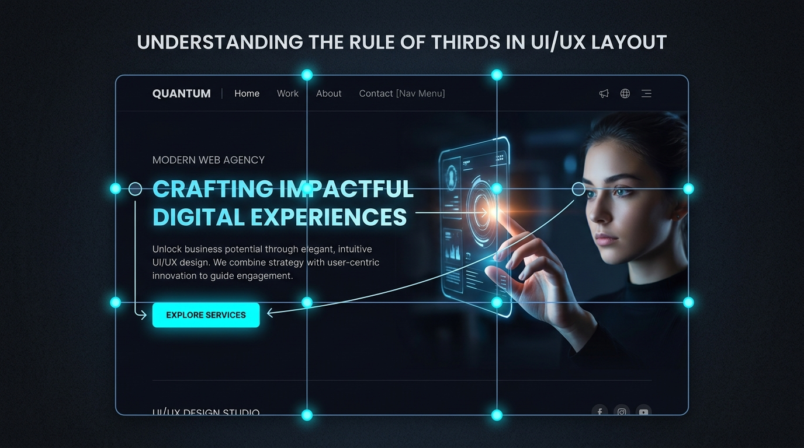
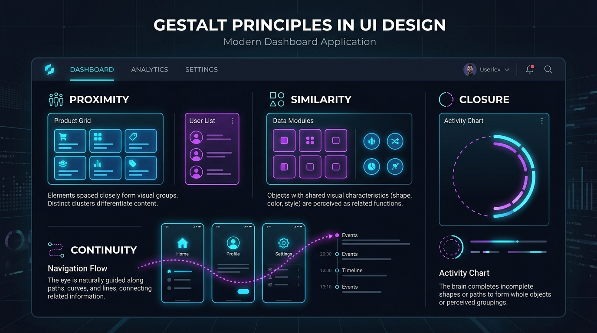
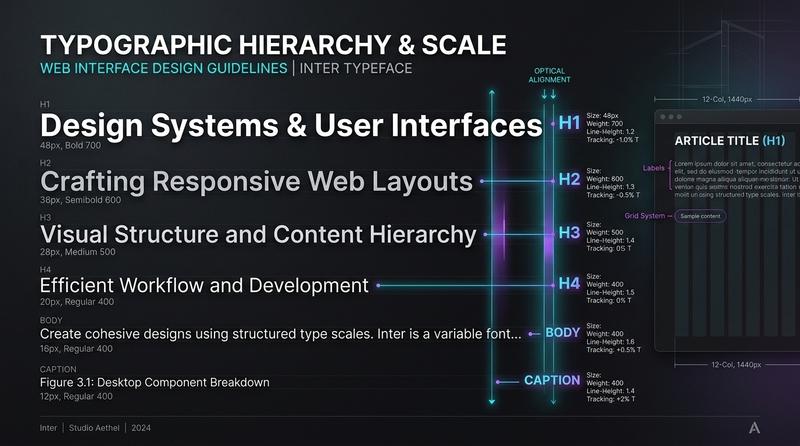

# UI/UX Visual Principles Cheat Sheet

A comprehensive visual guide containing design diagrams, key rules, and formulas for color systems, composition grids, psychology, alignment principles, and typography.

---

## Table of Contents
1. [Color Wheel & Harmonies](#1-color-wheel--harmonies)
2. [Golden Ratio (1.618)](#2-golden-ratio-1618)
3. [Color Psychology in UI/UX](#3-color-psychology-in-uiux)
4. [Rule of Thirds & Visual Hierarchy](#4-rule-of-thirds--visual-hierarchy)
5. [Gestalt Principles in Interface Design](#5-gestalt-principles-in-interface-design)
6. [Typography Scale & Hierarchy](#6-typography-scale--hierarchy)

---

## 1. Color Wheel & Harmonies

The color wheel is a visual representation of colors arranged according to their chromatic relationship. Choosing colors based on geometric formulas ensures balanced contrast and visual synergy.

### Core Harmony Formulas:
*   **Monochromatic**: Selecting one base hue and modifying only its saturation and lightness. Best for cohesive, clean, and elegant design systems.
*   **Analogous**: Using three adjacent hues on the wheel (e.g., Blue, Blue-Green, Green). Yields a peaceful, natural, and low-contrast aesthetic.
*   **Complementary**: Two hues directly opposite each other (e.g., Orange and Blue). Offers maximum contrast and energy. Use the dominant color for 90% of the interface and the complementary accent for key CTA buttons.
*   **Split-Complementary**: Pairing a base hue with the two hues adjacent to its complement. Delivers high contrast without the aggressive visual tension of direct complements.
*   **Triadic**: Three hues spaced equally at 120° intervals. Provides a vibrant, high-energy palette. Must be balanced carefully (60-30-10 rule).

---

## 2. Golden Ratio (1.618)

The Golden Ratio ($\phi \approx 1.618$) is a mathematical ratio found throughout nature, architecture, and art. Applying it to digital design generates natural-feeling layouts, visual balance, and harmonious spacing systems.

### UI/UX Applications:
1.  **Layout Proportions (Sidebar vs. Main Content)**:
    *   If your container width is $W = 1440\text{px}$:
        *   **Main Content Area**: $\frac{1440}{1.618} \approx 890\text{px}$
        *   **Sidebar**: $1440 - 890 = 550\text{px}$
2.  **Typography Scale**:
    *   If body text size is $16\text{px}$, calculate headers using the golden ratio multiplier:
        *   $16\text{px} \times 1.618 = 25.88\text{px}$ (Use $26\text{px}$ or $24\text{px}$ H2)
        *   $26\text{px} \times 1.618 = 42\text{px}$ (Use $42\text{px}$ H1)
3.  **Component Sizing**: Aspect ratios for image containers and card items look most natural when sized at $16:10$ or $3:2$ (which approximate the Golden Ratio).

---

## 3. Color Psychology in UI/UX

Colors trigger subconscious emotional and physical reactions. Designing with color psychology builds instant trust and drives user actions matching the brand's intent.

### Brand & Interactive Colors Guide:
*   🔵 **Blue**: Calm, trust, security, reliability. Used by banking, corporate SaaS, and healthcare systems (e.g., Stripe, PayPal, Salesforce).
*   🔴 **Red**: Energy, passion, urgency, danger. Excellent for delete buttons, critical errors, or warning popups (e.g., Netflix, YouTube).
*   🟢 **Green**: Growth, health, success, safety. Perfect for success dialogs, purchase checkouts, or eco-friendly apps (e.g., Shopify, Spotify).
*   🟣 **Purple**: Luxury, wisdom, AI intelligence, premium tiers. Used to highlight feature upgrades, pro accounts, or smart AI functionalities (e.g., Twitch, Stripe Premium).
*   🟠 **Orange**: Warmth, enthusiasm, action. Stimulating accent color ideal for "Add to Cart" or positive attention callouts.

---

## 4. Rule of Thirds & Visual Hierarchy

The Rule of Thirds is a composition grid that divides an interface into a $3 \times 3$ grid with equal spacing. The most important visual components should be aligned along the gridlines or placed on their four intersections (focal points).

### Grid Guidelines:
*   **Focal Points**: Human eyes naturally look at the four intersections first (especially the top-left intersection in left-to-right reading cultures).
*   **CTA Placement**: Place your primary CTA button, key value statement, or focal point image at one of the intersections.
*   **Whitespace**: Keep remaining grid sections clean and spacious to let the main content breathe.

---

## 5. Gestalt Principles in Interface Design

Gestalt psychology describes how human minds naturally organize individual visual elements into groups and unified wholes. Using these principles reduces cognitive load for users.

### 4 Key Principles for UI Design:
1.  **Proximity**: Elements placed close to each other are perceived as a group (e.g., card title, body, and CTA grouped inside a single container).
2.  **Similarity**: Elements sharing visual attributes (color, size, shape) are grouped together (e.g., all active primary buttons styled identically).
3.  **Continuity**: The eye is guided to move smoothly along a line or curve, connecting distinct objects (e.g., horizontal carousel cards showing the edge of the next card to encourage swiping).
4.  **Closure**: The mind automatically fills in gaps to form a complete shape (e.g., outline icons with broken segments, or loading indicators).

---

## 6. Typography Scale & Hierarchy

A structured typographical scale establishes a clear visual order, guiding readers from titles to details without creating visual chaos.

### Typography Best Practices:
*   **Limit Font Families**: Use a maximum of 2 font families (e.g., one expressive serif or geometric sans-serif for headings, and a highly readable sans-serif for body text).
*   **Contrast Weights**: Establish contrast by varying font weights (e.g., H1 at `Bold 700` paired with body at `Regular 400`).
*   **Line Heights**: Keep body text line heights between `1.5` and `1.6` for optimal readability. Headings can use a tighter line height of `1.1` to `1.2` to keep them compact.
*   **Character Limits**: Maintain line lengths between 45 and 75 characters per line for body copy to prevent reading fatigue.
